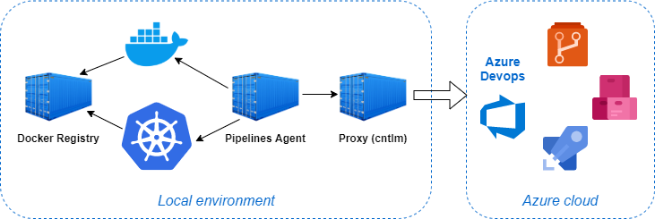

# Spring Boot demo

Before you start, make sure you have the following required software installed:
* Docker
* Kubernetes

Apart from that, you will also need an [Azure DevOps](https://dev.azure.com) account. 

This demo application is based on the sample Spring Boot repository (https://github.com/spring-guides/gs-spring-boot-docker). The original repository contains the following instructions on how to build the application and containerize it.

Steps to build the app using Maven
```
./mvnw package
```
Steps to build the Docker image
```
mkdir -p target/dependency && (cd target/dependency; jar -xf ../*.jar)
docker build -t springio/gs-spring-boot-docker .
```

## Setup
This demo implements an hybrid solution using Cloud and On-premises services. The goal is to deploy to a local development environment using the Azure DevOps services. The following table summarizes the components used in the demo:

| Component | Used here | Alternatives |
| --- | --- | --- |
| Code repository | Azure Repos | GitHub |
| CI/CD Pipeline | Azure Pipelines | |
| Artifact repository | Azure Artifacts | |
| Docker registry | Local installation | Azure Container Registry |
| Kubernetes | Local installation | Azure Kubernets Service |



### Preparation
Create a new project in your Azure DevOps organization, you can call it 'demo'.
- In the "Project settings", enable the services Repos, Pipelines and Artifacts.
- In the "Repos"menu, import this git repository.
- In de "Pipelines" menu, add a new Environment called 'demo' with no resources.

### Azure Pipelines agent
To be able to run pipeline jobs in our local machine we will run a self-hosted agent. The agent is deployed in a container, following the instructions in the [dockeragent](dockeragent) folder.

For more information about how to setup an agent, see [Azure Pipelines agents](https://docs.microsoft.com/en-us/azure/devops/pipelines/agents/agents?view=azure-devops&tabs=browser)

### Docker registry
We will deploy a local registry server using the official [Docker Registry](https://hub.docker.com/_/registry) image. The following are the configuration details:
* Registry address: **172.17.0.1:5000**
* Credentials: **testuser:testpassword**

IMPORTANT: As the docker registry uses a self-signed certificate, you must add the registry address to the docker configuration (daemon.json) to allow push/pull to/from it.
```
  "insecure-registries": [
    "172.17.0.1:5000"
  ],
```
For detailed instructions on how to deploy a registry, see [Deploy a registry server](https://docs.docker.com/registry/deploying/)

### Service connections
In you project settings, create a new service connection for the Docker registry with the following configuration:
* Registry type: **Others**
* Docker Registry: **https://172.17.0.1:5000/v2**
* Docker ID: **testuser**
* Docker Password: **testpassword**
* Service connection name: **Local Registry**

Add also a service connection for Kubernetes with the below configuration:
* Authentication method: **KubeConfig**
* KubeConfig: Copy&Paste the contents of the config file (~/.kube/config)
* Check "Accept untrusted certificates"
* Service connection name: **Local Kubernetes**
* Click "Save without verification"

## Multi-stage pipeline
Go to Pipelines and new pipeline selecting the Azure Repos that you just imported before. The repository contains the file `azure-pipelines.yml` with the code to build and deploy the demo application in your Kubernetes cluster.

To learn more, there is a good article in the Azure DevOps documentation: [Build and deploy to Azure Kubernetes Service](https://docs.microsoft.com/en-us/azure/devops/pipelines/ecosystems/kubernetes/aks-template?view=azure-devops)

